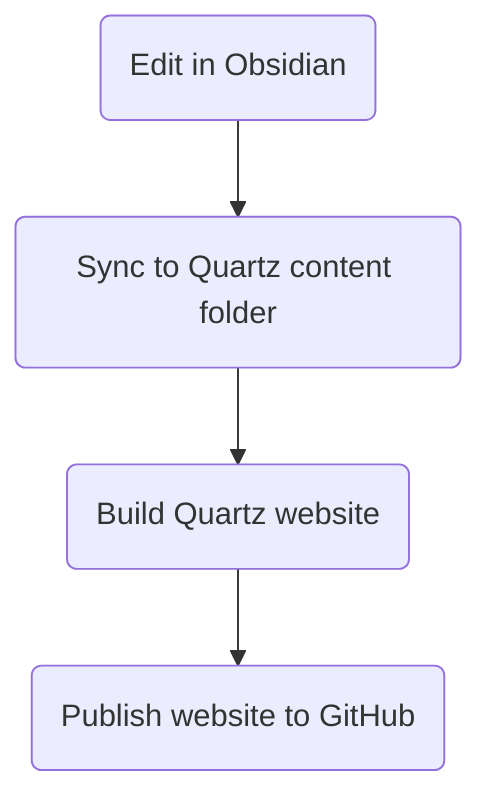

# Installing

## Windows

Chose a location for the obsidian folder. I recommend a folder in OneDrive, so that it is always backed up.

In my case, this folder is:

	%USERPROFILE%\OneDrive\Documents\Demian\Obsidian

## Android

Chose a location for the obsidian folder. The recommended location is:

	/Internal storage/Documents/Obsidian/

# Sync via OneDrive

Sync means ensuring the same Obsidian vault is kept in sync across different instances, typically between a Windows and Android instance.

Here we will assume that the vault was first created in the Windows instance, and that we are using the Windows and Android folders recommended above.

## Setup Remotely-Save plugin

Open the Windows vault to sync and install and enable the **Remotely Save** Community Plugin. Choose the Remote Service "OneDrive for Personal", and then click the `Auth` button to authenticate to OneDrive. Before exiting the plugin options, scroll down and set the `Abort Sync if Modification Above Percentage"` option to `100%`. This will be useful to avoid error messages during first syncs.

You can trigger a sync either by using the command menu (`Ctrl+P`) or by clicking on the sync icon that appears on the left margin. Either way, this should trigger the sync to via the default location, which in the case of OneDrive is at:

	My files > Apps > remotely-save

## Copy vault to Android

In Windows, compress target Obsidian folder into zip file. For example, the folder `Tech Vault` should be compressed into `Tech Vault.zip`.

Copy the zip file above to the Android. If using OneDrive, the best way is to let OneDrive sync the zip file over to the Android system for you.

In Android, extract the contents of the zip file to the Obsidian folder, so that you are left with a `Tech Vault` folder identical to the one you had in Windows.

In Android, open Obsidian and chose `Manage Vaults` from the vault dropdown. Select the location of the vault extracted in the step above. Accept all the security warnings to accept the vault location and enable the plugins.

The vault should open and, crucially, it should do so with all the plugins configured. This is especially important for the **remotely-save** plugin, which will come with OneDrive already authenticated from the Windows vault. This is a workaround that solves the problem of not being able to authenticate to OneDrive from Android due to a model window never closing.

You can trigger a sync just like in Windows, either by using the command menu (`Ctrl+P`) or by clicking on the sync icon that appears on the left margin. Either way, this should trigger the sync.

In theory, it should all sync correctly. Just to be sure, make a change in Android and sync, then open the same vault in Windows and sync. The changes should be replicated. Try the sync in either direction, leaving one second or two after triggering a sync to let OneDrive do its replication.

Once you are happy that everything is working, go to `Settings > Remotely Save` and ensure the `Abort Sync if Modification Above Percentage"` option is set back to  `50%` in both the Windows and Android vault.

# Publish via Quartz

There are several ways to publish a vault as a website, including paying for the default Obsidian service at 8 $/month, which also includes seamless sync.

A popular method is to use Quartz, a static-site generator that transforms markdown content into fully functional web-sites using nodejs, and which is compatible with Obsidian.

The workflow can be summarized as follows:



Full instructions can be found [here](https://quartz.jzhao.xyz/), but this document contains everything you need for a quick installation.

The instructions below assumes that we are publishing in a Linux environment (or WSL in Windows).

### Setup folders

First, chose a folder in which to manage the Quartz website. In theory, you could install Quartz directly in the same folder of the Obsidian vault to publish, but this is **not** recommended as Quartz clutters the folder with many artifacts required to generate the site, including the infamous `node_modules` folder. For this reason, we recommend that the Quartz folder is **not** synced by OneDrive.

In my case, the chosen Quartz folder is under `~/quartz/`. For example, for a vault named `Tech Vault` I would chose a Quartz folder `~/quartz/tech`. In other words, the same name as the vault, but without the `Vault` suffix, and all lowercase, so that it plays better with Linux workflows.

In fact, this is an example mapping of all the folder locations of a vault name `Tech Vault` that has been setup for sync and publish:

| Location      | Path                                                          |
| ------------- | ------------------------------------------------------------- |
| Vault name    | `Tech Vault`                                                  |
| Windows       | `%USERPROFILE%\OneDrive\Documents\Demian\Obsidian\Tech Vault` |
| Android       | `/Internal storage/Documents/Obsidian/Tech Vault`             |
| Remotely Save | `%USERPROFILE%\OneDrive\Apps\remotely-save\Tech Vault`        |
| Quartz        | `~/quartz/tech`                                               |

Given the above, ensure the base Quartz folder exists in the location recommended above:

```sh
mkdir -p ~/quartz
```

### Init Quartz

Then clone the Quartz repo as a start for the vault to publish:

```sh
cd ~/quartz
git clone https://github.com/jackyzha0/quartz.git vault_name
cd vault_name
npm install
npx quartz create
```

Optionally, [configure](https://quartz.jzhao.xyz/configuration) Quartz or [change the layout](https://quartz.jzhao.xyz/layout). For example, it is recommended to create a Website Title.

The Quartz folder show be hosted in a GitHub repo. This not only gives you version control, but also allows you to publish your website online via [GitHub Pages](https://pages.github.com/).

To sync with GitHub, follow the instructions [here](https://quartz.jzhao.xyz/setting-up-your-GitHub-repository). Of course, you will need to have a GitHub account with a properly configured SSH key, so that you can connect to it from your shell.

### Create content

At this point, you can start creating content to publish. All content in Quartz is located in the `content/` folder. In theory, you could open this folder in Obsidian directly, and start editing at will. However, we recommend editing content in an Obsidian vault outside of the Quartz folder, and then use a sync tool to push changes to the Quartz `content/` folder. Given that publishing Quartz sites requires a DevOps build pipeline anyway, there is no harm in adding this sync step first. As stated above, editing content in an Obsidian vault outside of the Quartz folder keeps the Obsidian vault clean and small, which in turn means fast syncs across devices and with OneDrive.

Keeping the Obsidian vault in sync with the Quartz content folder can be done with a GUI tool like beyond compare, or more simply with a Linux command like `rsync`. Assuming a vault named `Tech Vault`, this could be done with the command:

```sh
rsync --delete --recursive --exclude='.git*' --exclude='.obsidian' /mnt/c/path/to/obsidian/vault/in/windows/'Tech Vault'/* ~/quartz/tech/content/
```

I like creating aliases for this and other Quartz workflow in my `.bashrc` file:

```sh
# Tech Vault
alias obs-tech-rsync="rsync --delete --recursive --exclude='.git*' --exclude='.obsidian' ~/obsidian/'Tech Vault'/* ~/quartz/tech/content/"
alias obs-tech-build="cd ~/quartz/tech/; npx quartz build; cd ~"
alias obs-tech-sync="cd ~/quartz/tech/; npx quartz sync; cd ~"
alias obs-tech-all="obs-tech-rsync; obs-tech-build; obs-tech-sync"
alias ota="obs-tech-all"
```

### Build Quartz website

This can be done using the following command from the base of the Quartz folder:

```sh
npx quartz build
```

Or, to see the results in a local web server (prior to publishing online):

```sh
npx quartz build --serve
```

### Publish Quartz website

If set up correctly, publishing can be done automatically simply by synching the quartz website tot  